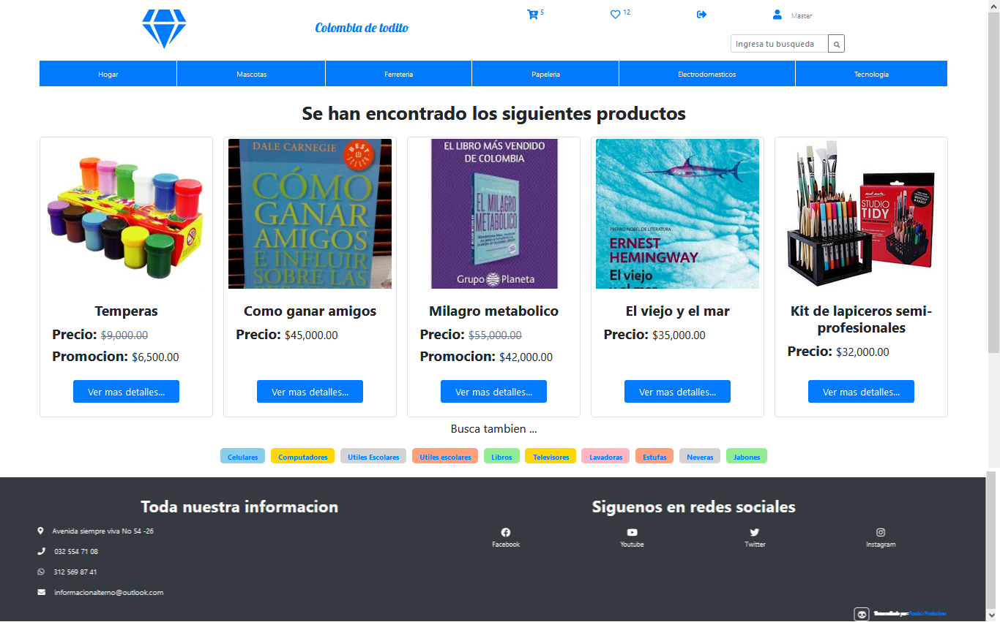
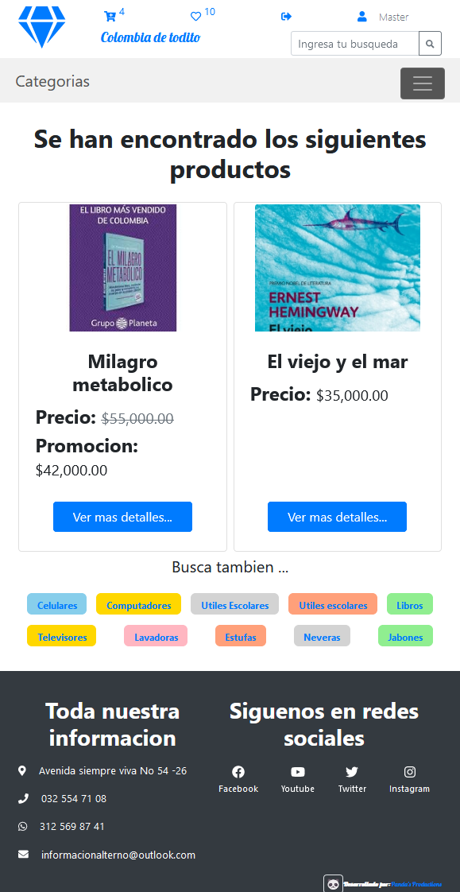
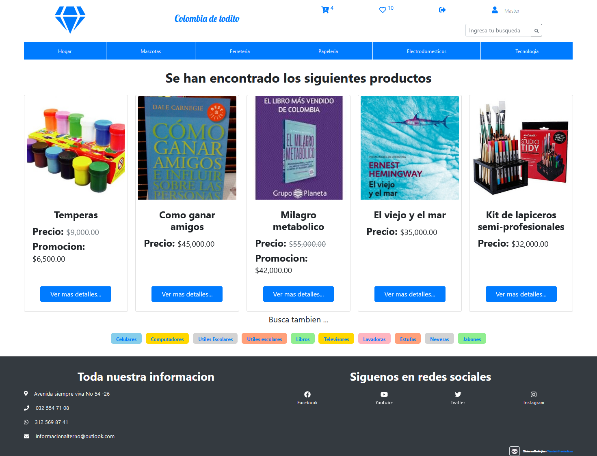
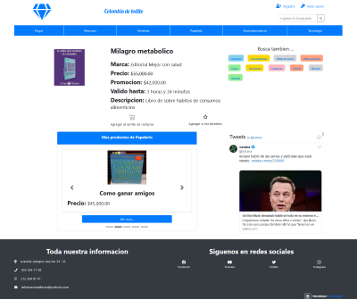
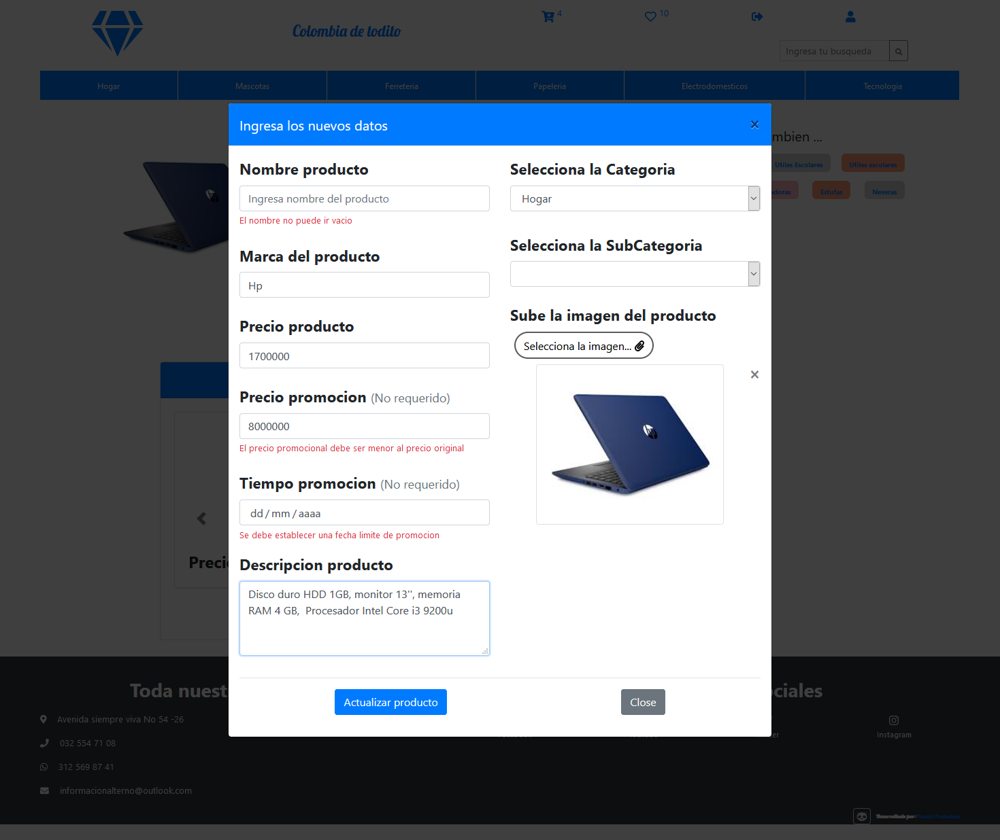
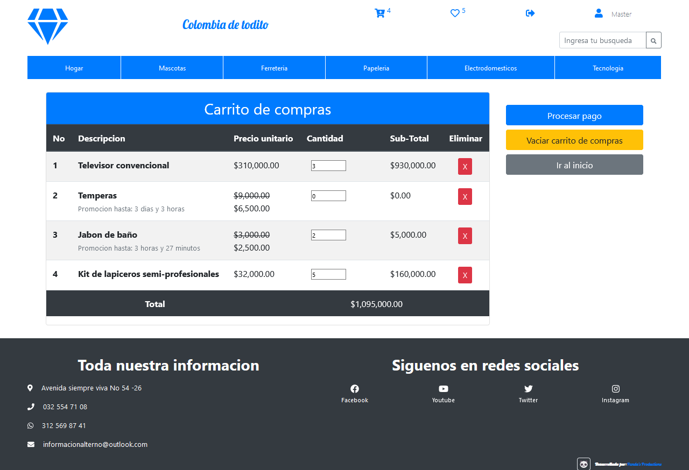

# MEAN-WebStore
## Fullstack de una aplicacion de una tienda en linea 

> Pagina de inicio

## Tecnologias utilizadas

 
 

> Framesworks y librerias para la construccion del sitio

## Capturas de pantalla en celulares, ipad & desktop

> Aplicativo web responsive

## Complements front-end

## Temporizador para estabecer promocion

> Establecer una promocion con un temporizador que indica su tiempo restante

## Formulario reactivo

> Formulario reactivo que brindan realimentacion al usuario de posibles errores al ingresar de informacion

## Listado de productos favoritos por cada usuario

> Se puede establecer una lista de productos favoritos que pueden enviarse al carrito de compras

## Listado de productos favoritos por cada usuario

> Carrito de compras donde se puede elegir la cantidad de productos a comprar que al final calcula el total 
